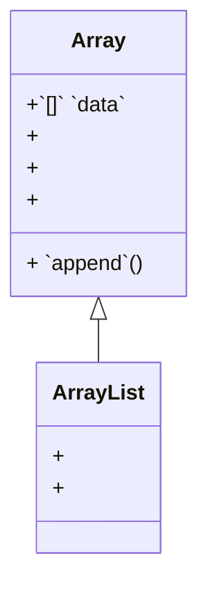

`ArrayList`<swm-token data-swm-token=":ArrayList.py:24:2:2:`class ArrayList(Array):`"/> - это класс, который представляет собой динамический массив в языке программирования Python. Это означает, что `ArrayList`<swm-token data-swm-token=":ArrayList.py:24:2:2:`class ArrayList(Array):`"/> может содержать набор элементов, который может расти и уменьшаться по мере необходимости, и не требует заранее заданного размера. `ArrayList`<swm-token data-swm-token=":ArrayList.py:24:2:2:`class ArrayList(Array):`"/> является наследником класса `Array`<swm-token data-swm-token=":ArrayList.py:1:2:2:`class Array:`"/>, что означает, что он наследует базовую функциональность работы с массивами.

Дополнительную информацию о родительском классе `Array`<swm-token data-swm-token=":ArrayList.py:1:2:2:`class Array:`"/> можно получить [Класс Array](array.72m984h2.sw.md)

<br/>

Здесь представлен класс `ArrayList`<swm-token data-swm-token=":ArrayList.py:24:2:2:`class ArrayList(Array):`"/> дочерний класс класса `Array`<swm-token data-swm-token=":ArrayList.py:1:2:2:`class Array:`"/>
<!-- NOTE-swimm-snippet: the lines below link your snippet to Swimm -->
### 📄 ArrayList.py
```python
24     class ArrayList(Array):
25         def insert(self, index, value):
26             if 0 <= index <= len(self.data):
27                 self.data.insert(index, value)
28             else:
29                 print("Index out of range")
30     
31         def pop(self, index=-1):
32             if self.data:
33                 if 0 <= index < len(self.data):
34                     return self.data.pop(index)
35                 else:
36                     print("Index out of range")
37             else:
38                 print("ArrayList is empty")
```

<br/>

`ArrayList`<swm-token data-swm-token=":ArrayList.py:24:2:2:`class ArrayList(Array):`"/> предоставляет более широкий набор операций для манипуляции данными в сравнении с базовым классом `Array`<swm-token data-swm-token=":ArrayList.py:1:2:2:`class Array:`"/>. Он позволяет вставлять элементы в середину массива, удалять элементы по индексу и многое другое. Это делает его более гибким инструментом для работы с данными в сравнении с обычным массивом.

## Атрибуты:

*   `data`<swm-token data-swm-token=":ArrayList.py:3:3:3:`        self.data = []`"/>: Внутренний список, в котором хранятся элементы `ArrayList`<swm-token data-swm-token=":ArrayList.py:24:2:2:`class ArrayList(Array):`"/> наследуется от `Array`<swm-token data-swm-token=":ArrayList.py:1:2:2:`class Array:`"/>

## Методы:

*   `__init__`<swm-token data-swm-token=":ArrayList.py:2:3:3:`    def __init__(self):`"/>: Инициализирует пустой `ArrayList`<swm-token data-swm-token=":ArrayList.py:24:2:2:`class ArrayList(Array):`"/> _наследуется от_ `Array`<swm-token data-swm-token=":ArrayList.py:1:2:2:`class Array:`"/> .

*   `append`<swm-token data-swm-token=":ArrayList.py:5:3:3:`    def append(self, value):`"/>: Добавляет указанное значение в конец `ArrayList`<swm-token data-swm-token=":ArrayList.py:24:2:2:`class ArrayList(Array):`"/>_наследуется от_`Array`<swm-token data-swm-token=":ArrayList.py:1:2:2:`class Array:`"/>.

*   `get`<swm-token data-swm-token=":ArrayList.py:8:3:3:`    def get(self, index):`"/>: Возвращает элемент по указанному индексу в `ArrayList`<swm-token data-swm-token=":ArrayList.py:24:2:2:`class ArrayList(Array):`"/>_наследуется от_`Array`<swm-token data-swm-token=":ArrayList.py:1:2:2:`class Array:`"/>.

*   `size`<swm-token data-swm-token=":ArrayList.py:14:3:3:`    def size(self):`"/>: Возвращает текущий размер `ArrayList`<swm-token data-swm-token=":ArrayList.py:24:2:2:`class ArrayList(Array):`"/>_наследуется от_`Array`<swm-token data-swm-token=":ArrayList.py:1:2:2:`class Array:`"/>.

*   `remove`<swm-token data-swm-token=":ArrayList.py:17:3:3:`    def remove(self, value):`"/>: Удаляет первое вхождение указанного значения из `ArrayList`<swm-token data-swm-token=":ArrayList.py:24:2:2:`class ArrayList(Array):`"/>_наследуется от_`Array`<swm-token data-swm-token=":ArrayList.py:1:2:2:`class Array:`"/>.

*   `insert`<swm-token data-swm-token=":ArrayList.py:25:3:3:`    def insert(self, index, value):`"/>: Вставляет элемент в указанный индекс в `ArrayList`<swm-token data-swm-token=":ArrayList.py:24:2:2:`class ArrayList(Array):`"/>.

*   `pop`<swm-token data-swm-token=":ArrayList.py:31:3:3:`    def pop(self, index=-1):`"/>: Удаляет элемент из конца `ArrayList`<swm-token data-swm-token=":ArrayList.py:24:2:2:`class ArrayList(Array):`"/> (если не указан индекс) или по указанному индексу.

    <br/>

<br/>

<!--MERMAID {width:100}-->

<!--MCONTENT {content: "classDiagram<br/>\n`Array`<swm-token data-swm-token=\":ArrayList.py:1:2:2:`class Array:`\"/> <|-- `ArrayList`<swm-token data-swm-token=\":ArrayList.py:24:2:2:`class ArrayList(Array):`\"/><br/>\n`Array`<swm-token data-swm-token=\":ArrayList.py:1:2:2:`class Array:`\"/>: +`[]`<swm-token data-swm-token=\":ArrayList.py:3:7:8:`        self.data = []`\"/> `data`<swm-token data-swm-token=\":ArrayList.py:3:3:3:`        self.data = []`\"/><br/>\n`Array`<swm-token data-swm-token=\":ArrayList.py:1:2:2:`class Array:`\"/>: + `append`<swm-token data-swm-token=\":ArrayList.py:5:3:3:`    def append(self, value):`\"/>()<br/>\n`Array`<swm-token data-swm-token=\":ArrayList.py:1:2:2:`class Array:`\"/>: +<br/>\n`Array`<swm-token data-swm-token=\":ArrayList.py:1:2:2:`class Array:`\"/>: +<br/>\n`Array`<swm-token data-swm-token=\":ArrayList.py:1:2:2:`class Array:`\"/>: +<br/>\nclass `ArrayList`<swm-token data-swm-token=\":ArrayList.py:24:2:2:`class ArrayList(Array):`\"/>{<br/>\n+<br/>\n+<br/>\n}<br/>\n<br/><br/>"} --->

<br/>

<br/>

<br/>

This file was generated by Swimm. [Click here to view it in the app](https://app.swimm.io/repos/Z2l0aHViJTNBJTNBQXJyYXlMaXN0JTNBJTNBSXZhbmdvMTI4/docs/qpoj4aub).
